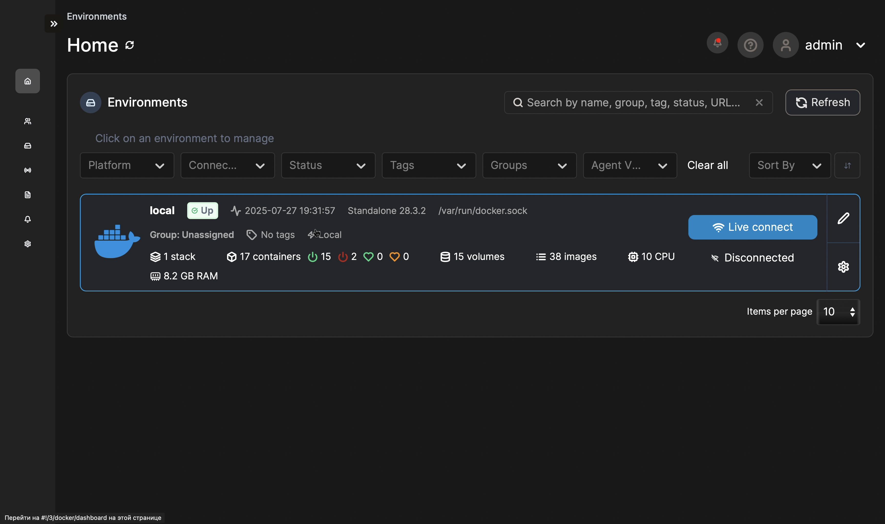

# Специальное предложение

[Получите доступ к полному курсу со скидкой](https://forms.yandex.ru/u/67d7c91090fa7b031901abaa/)

## C#: Руководство по созданию микросервисов на .NET
Добро пожаловать в комплексный курс по разработке микросервисов на .NET и C# с использованием передовых технологий и подходов современного бэкенд-разработчика. 

## О курсе

Это публичный репозиторий курса, в рамках которое является детальным руководством по созданию микросервисов с чистой архитектурой и современными интеграциями. Вы научитесь:

- Использовать CQRS и MediatR для четкого разделения команд и запросов,
- Настраивать и использовать базы данных PostgreSQL и MySQL с Marten, Dapper ORM и Entity Framework,
- Версионировать и документировать API с помощью Swagger,
- Реализовывать высокопроизводительный синхронный gRPC и асинхронный обмен сообщениями через RabbitMQ и MassTransit,
- Внедрять Redis для кэширования и увеличения производительности,
- Автоматизировать CI/CD процессы с GitHub Actions, создавать шаблоны проектов,
- Строить централизованную систему логирования на базе Serilog и ELK Stack,
- Настраивать сбор и визуализацию метрик через Prometheus и Grafana,
- Проводить нагрузочное тестирование сервисов с k6,
- Управлять контейнеризированной инфраструктурой с помощью Docker и Portainer,
- Применять лучшие паттерны проектирования и практики аудита для повышения надежности приложений.

Курс идеально подходит для backend-разработчиков и архитекторов, желающих освоить современные практики построения микросервисной архитектуры от начала до production-уровня.

## Структура курса

Модульно построенный учебный план охватывает все этапы разработки — от создания шаблона микросервиса, через построение каталогов и корзин, интеграцию промоакций, оформление заказов, до месседжинга, логирования, мониторинга и управления инфраструктурой.

- Модуль 1-2: Шаблон микросервиса, инфраструктура и DevOps автоматизация
- Модуль 3-5: Каталог микросервиса и продвинутые CQRS-паттерны
- Модуль 6-7: Корзина и Redis-кэширование
- Модуль 8-9: Микросервис промоакций с gRPC и MySQL
- Модуль 10-11: Интеграция микросервисов, взаимодействие и промо
- Модуль 12-13: Оформление заказов с EF Core и CQRS
- Модуль 14: Месседжинг, RabbitMQ и MassTransit
- Модуль 15: Логирование, мониторинг с ELK, Prometheus, Grafana и управление Docker-инфраструктурой
- _Модуль 16 и дальше: возможно появятся новые модули_

## Основные технологии и библиотеки

### Таблица NuGet-библиотек
| Logo | Наименование библиотеки | Версия | Описание |
| :-- | :-- | :-- | :-- |
|  | Asp.Versioning.Mvc | 8.1.0 | API версияция для ASP.NET MVC |
|  | Asp.Versioning.Mvc.ApiExplorer | 8.1.0 | API версияция с поддержкой ApiExplorer |
|  | Carter | 9.0.0 | Легкий фреймворк для построения HTTP API |
|  | Dapper | 2.1.66 | Микро ORM для доступа к базе данных |
|  | FluentValidation | 12.0.0 | Валидация моделей с Fluent синтаксисом |
|  | FluentValidation.DependencyInjectionExtensions | 12.0.0 | Внедрение FluentValidation в DI контейнер |
|  | Google.Protobuf | 3.31.1 | Сериализация и десериализация Protocol Buffers |
|  | Grpc.AspNetCore | 2.71.0 | gRPC сервер для ASP.NET Core |
|  | Grpc.AspNetCore.Server.ClientFactory | 2.71.0 | gRPC серверный клиент фабрика для ASP.NET Core |
|  | Grpc.AspNetCore.Server.Reflection | 2.71.0 | gRPC сервер Reflection для ASP.NET Core |
|  | Grpc.Tools | 2.72.0 | Инструменты разработки gRPC |
|  | Mapster | 7.4.0 | Объектно-реляционное маппирование и маппинг |
|  | Mapster.DependencyInjection | 1.0.1 | Mapster с поддержкой DI |
|  | Marten | 8.3.1 | Транзакционная DocumentDB и Event Store для PostgreSQL |
|  | MassTransit.RabbitMQ | 8.5.1 | RabbitMQ интеграция для MassTransit |
|  | MediatR | 13.0.0 | Реализация паттерна Mediator для .NET |
|  | Microsoft.CodeAnalysis.CSharp.Workspaces | 4.11.0 | Рабочие пространства для C# с анализатором Roslyn |
|  | Microsoft.CodeAnalysis.Common | 4.11.0 | Общие библиотеки Roslyn для анализа кода |
|  | Microsoft.EntityFrameworkCore | 9.0.7 | EF Core основной пакет для работы с БД |
|  | Microsoft.EntityFrameworkCore.Design | 9.0.7 | Инструменты проектирования EF Core |
|  | Microsoft.EntityFrameworkCore.Tools | 9.0.7 | Инструменты командной строки и миграций EF Core |
|  | Microsoft.Extensions.Caching.StackExchangeRedis | 9.0.7 | Кэширование с использованием Redis |
|  | Microsoft.Extensions.Configuration | 9.0.7 | Конфигурация приложения |
|  | Microsoft.Extensions.DependencyInjection.Abstractions | 9.0.7 | Интерфейсы для DI |
|  | Microsoft.FeatureManagement.AspNetCore | 4.2.1 | Фича-менеджмент для ASP.NET Core |
|  | MySqlConnector | 2.4.0 | Асинхронный MySQL коннектор |
|  | Npgsql.EntityFrameworkCore.PostgreSQL | 9.0.4 | PostgreSQL EF Core провайдер |
|  | Scrutor | 6.1.0 | Расширение для регистрации сервисов с фильтрами |
|  | Serilog | 4.3.0 | Логирование с Serilog |
|  | Serilog.AspNetCore | 9.0.0 | Интеграция Serilog в ASP.NET Core |
|  | Serilog.Enrichers.CorrelationId | 3.0.1 | Enricher для CorrelationId в логах |
|  | Serilog.Enrichers.Environment | 3.0.1 | Enricher для окружения в логах |
|  | Serilog.Extensions.Hosting | 9.0.0 | Регистрация Serilog как хоста приложения |
|  | Serilog.Settings.Configuration | 9.0.0 | Настройки Serilog через конфигурацию |
|  | Serilog.Sinks.Console | 6.0.0 | Логирование в консоль |
|  | Serilog.Sinks.Elasticsearch | 10.0.0 | Логирование в Elasticsearch |
|  | Serilog.Sinks.File | 7.0.0 | Логирование в файл |
|  | Swashbuckle.AspNetCore | 9.0.3 | Swagger для ASP.NET Core |
|  | Swashbuckle.AspNetCore.Annotations | 9.0.3 | Swagger Annotations для документации API |
|  | prometheus-net.AspNetCore | 8.2.1 | Prometheus метрики для ASP.NET Core |

### Таблица с docker образами
| Logo | Наименование образа | Краткое описание назначения |
| :-- | :-- | :-- |
|  | [postgres](https://hub.docker.com/_/postgres) | Официальный образ PostgreSQL, используется как СУБД для Rest-сервисов |
|  | [redis](https://hub.docker.com/_/redis) | In-memory хранилище данных и кэша |
|  | [mysql:8.0](https://hub.docker.com/_/mysql) | Официальный MySQL образ, используется как СУБД для gRPC-сервиса |
|  | [rabbitmq:3-management](https://hub.docker.com/_/rabbitmq) | Очередь сообщений RabbitMQ с UI менеджером, обеспечивает асинхронное взаимодействие сервисов |
|  | [elasticsearch:9.0.3](https://hub.docker.com/_/elasticsearch) | Поисковый и аналитический движок, обеспечивает хранение и поиск для сервисов |
|  | [kibana:9.0.3](https://hub.docker.com/_/kibana) | Визуализация логов и данных из Elasticsearch, мониторинг состояния |
|  | [grafana/k6](https://hub.docker.com/r/grafana/k6) | Инструмент для нагрузочного тестирования API сервисов |
|  | [prom/prometheus](https://hub.docker.com/r/prom/prometheus) | Система мониторинга и сбора метрик приложений и сервисов |
|  | [grafana/grafana](https://hub.docker.com/r/grafana/grafana) | Веб-интерфейс для визуализации и анализа метрик, интегрируется с Prometheus |
|  | [portainer/portainer-ce](https://hub.docker.com/r/portainer/portainer-ce) | Веб-интерфейс для управления Docker-контейнерами и кластерами |

## Что вы получите

- Полную архитектуру с реализацией шаблонного микросервиса,
- Готовые шаблоны для CQRS, MediatR, gRPC, RabbitMQ,
- Надежные практики логирования и мониторинга,
- Отработанные шаблоны интеграций и продвинутой обработки ошибок,
- Производительность и устойчивость сервисов на практике,
- Уникальный опыт создания рабочей инфраструктуры для микросервисов.

## Инструменты мониторинга, логирования и документации

Последние разделы курса посвящены не только автоматизации и инфраструктуре, но и построению системы наблюдаемости микросервисов с помощью лучших инструментов — ELK Stack (стек для агрегации и визуализации логов), Prometheus и Grafana (для метрик и дашбордов), Portainer (интерфейс для управления Docker-инфраструктурой), а также интерактивной Swagger-документации.

Вы увидите, как:

- В одной системе собирать и анализировать структурированные логи в Kibana через ELK;
- Обеспечивать мониторинг промышленных метрик с Prometheus и строить наглядные графики в Grafana;
- Гибко управлять всеми контейнерами через Portainer;
- Предоставлять удобную, версионированную, интерактивную документацию API через Swagger UI.

## Живые скриншоты по реальным интерфейсам и дашбордам

### Swagger UI микросервис каталога

 

### Swagger UI микросервис корзины

 

### Микросервис скидок, доступ только с postman

 

### Swagger UI микросервис заказов

### Мониторинг логов и некоторые метрики

### Веб-интерфейс prometheus

### Дашборд с мониторингом микросервиса каталога

### Логи k6 на чтение [скрипт можно посмотреть тут](./k6/catalog-api-load-test.js)

### Логи k6 на запись [скрипт можно посмотреть тут](./k6/catalog-api-create-items-test.js)

### Работоспособность приложения поддерживают 17 контейнеров

   

---

   

---

   

### Ссылки для локального `localhost`

| Сервис         | URL для доступа                                     |
|----------------|-----------------------------------------------------|
| catalog-api    | http://localhost:7301/swagger/                      |
| basket-api     | http://localhost:7302/swagger/                      |
| promotion-api  | grpc://localhost:7313                               |
| checkout-api   | http://localhost:7304/swagger/                      |
| portainer      | https://localhost:9443                              |
| grafana        | http://localhost:3000                               |
| prometheus     | http://localhost:9090                               |
| kibana         | http://localhost:5601                               |
| rabbitmq UI    | http://localhost:15672                              |
